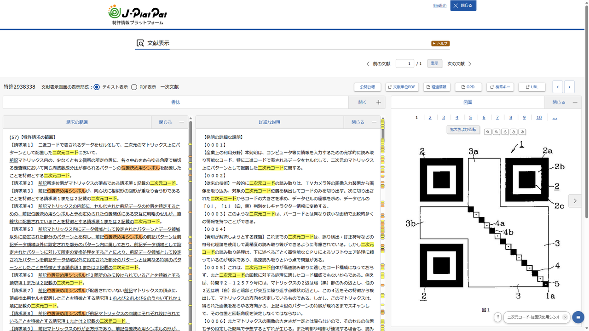

# 2列表示ビューア for J-PlatPat(非公式)

J-PlatPat(特許情報プラットフォーム)の文献表示画面を、「請求の範囲」と「詳細な説明」の左右2列表示に組み替えるブラウザ拡張機能です(Google Chrome / Microsoft Edge 対応)。請求項の用語と明細書中の符号・実施例とを対比しながら公報を読めます。

> **本拡張機能は個人が開発した非公式ツールです。** J-PlatPatは独立行政法人工業所有権情報・研修館(INPIT)が提供する無料のサービスであり、本拡張機能はその表示を補助するものにすぎず、INPITおよび特許庁とは関係ありません。

## 機能

- 「請求の範囲」と「詳細な説明」の左右2列表示・ペインごとの個別スクロール(見出しは上部に固定)
- ページ中央寄せの左右余白を除去して全幅表示
- 図面ペインは固定幅で画面に追従(下までスクロールしても消えません)。幅はボタンで調整可能
- 図面のその場拡大・縮小・90度回転・ドラッグ移動(公式の「拡大および回転」と同じ並びのボタン)
- 文献ヘッダー(番号・ボタン列・表示形式)を1行に圧縮して表示領域を拡大
- 「前の文献」「次の文献」への移動ボタンをヘッダーに追加
- 書誌・要約パネルの横並び表示
- 位置記憶:「次の文献」「前の文献」で移動しても各ペインのスクロール位置を引き継ぎ
- キーワードハイライト:入力した語を両ペインで色分け表示(文献を移動しても維持)し、ヒット位置をペイン右端のマーカーに表示(クリックでジャンプ)
- すべての機能は画面右下のボタンからON/OFF可能。OFFで完全に元の表示に戻ります

## インストール

### ストアから

- [Chromeウェブストア](https://chromewebstore.google.com/detail/mnenoildfpopliodhgklelngjiglhmlf)からインストールできます。
- Microsoft Edgeをお使いの方も、上記Chromeウェブストアからインストールできます(初回に「他のストアからの拡張機能を許可する」の確認が表示されます)。

### 手動インストール

1. このページ上部の「Code」→「Download ZIP」でダウンロードして展開します。
2. Chrome/Edgeで `chrome://extensions`(Edgeは `edge://extensions`)を開き、「デベロッパーモード(開発者モード)」をオンにします。
3. 「パッケージ化されていない拡張機能を読み込む(展開して読み込み)」で、展開したフォルダ(manifest.jsonがあるフォルダ)を選択します。

## 安心してお使いいただくために

- 本拡張機能は、ブラウザが受信・表示したページのレイアウトを利用者のブラウザ内で変更するのみです。J-PlatPatのサーバーへ通常の閲覧以外のリクエストを送信することはありません。
- いかなるデータも収集・外部送信しません(通信機能を持ちません)。設定はブラウザ内にのみ保存されます。要求する権限は設定保存用の `storage` のみです。
- 動作するのはJ-PlatPatのドメイン(`https://www.j-platpat.inpit.go.jp/`)のみです。
- 公開に先立ち、INPITに動作内容を説明のうえ、J-PlatPat利用上の注意との関係を確認しています。

詳細は[プライバシーポリシー](PRIVACY.md)をご覧ください。

## 不具合報告・要望

[Issues](../../issues) へお願いします。J-PlatPat側の画面刷新等により動作しなくなった場合は、順次追従します。本拡張機能に関するお問い合わせをINPITのヘルプデスクに送ることはご遠慮ください。

## ライセンス

[MIT License](LICENSE)
